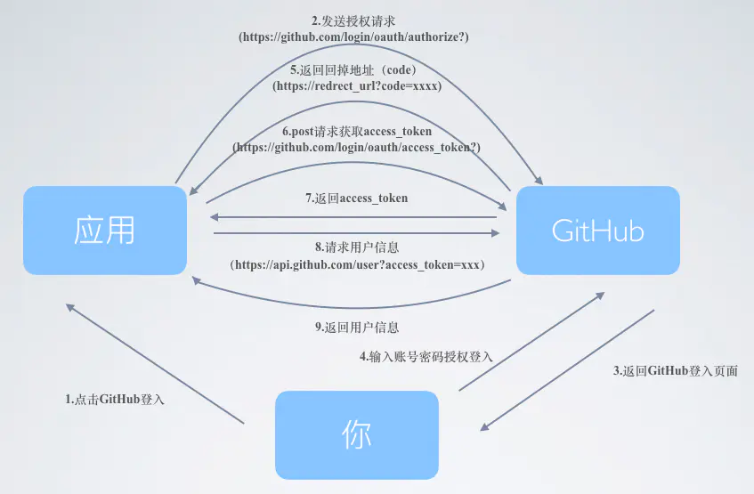

# OAUTH第三方登录


## 例子1：

- GITHUB: https://docs.github.com/en/developers/apps/authorizing-oauth-apps 

前端新开一个小窗口，width height可设定访问授权网址o
前端向后台请求，并带上当前地址(方便后续跳转回来)。后台返回认证地址及参数，使用window.location.href进行跳转。
```js
  login(){
            this.$axios({
                method: 'get',
                url: '/test/github/login',
                params: {
                    path: 'http://localhost:8080'+this.$route.fullPath
                }
            }).then((res)=>{
                console.log(res)
                window.location.href=res.data;
            })
          }
```

- 后端
```js
const config={
    client_id:'xxxx',    //github生成的ID及密码
    client_secret:'xxxxxxx'
};
let redirectPath='http://localhost:8080/'
router.get('/github/login',async (ctx)=>{
    if(ctx.query.path) redirectPath=ctx.query.path
    var dataStr=(new Date()).valueOf();
    //重定向到认证接口,并配置参数
    var path="https://github.com/login/oauth/authorize";
    path+='?client_id='+config.client_id;
    //将地址及参数返回前端
    ctx.body=path;
    //前端拿就会去访问
});
//认证后的github回调
router.get('/github/callback',async (ctx)=>{
    console.log('callback...')
    const code=ctx.query.code;    //返回的授权码
    const params={
        client_id:config.client_id,
        client_secret: config.client_secret,
        code:code
    }
    //使用这个授权码，向 GitHub 请求令牌
    let res=await axios.post('https://github.com/login/oauth/access_token', params)
    const access_token=querystring.parse(res.data).access_token
    //再通过令牌获取用户信息
    res=await axios.get('https://api.github.com/user?access_token=' + access_token)
    // console.log('userAccess:', res.data)
     // ctx.body = res.data
    ctx.cookies.set('user',res.data.login)  //用户名称
    ctx.cookies.set('icon',res.data.avatar_url)  //用户图片
    ctx.redirect(redirectPath)  //重定向到请求页面
})
```


## 例子2

2.1 前端实现
前端采用了掘金的授权登录方式，当用户点击第三方GitHub登录，弹出一个新窗口

`window.open("/oauth", "", "height=600, width=700")`
在这个新窗口里只需要跳转链接，client_id，redirect_uri 就是之前创建的参数配置自己的就行。

`window.location.href = 'github.com/login/oauth…'`
用户授权登录之后会跳到redirect页面，在redirect请求后端带上刚产生的code，后端拿到code请求github得到的用户信息资料，最后关闭弹窗。

2.2 后端实现
后端作者采用的是Koa2,代码如下
```js
router.get('/oauth', async function(ctx, next) {
  const requestToken = ctx.request.query.code
  const tokenResponse = await axios({
    method: 'post',
    url: 'https://github.com/login/oauth/access_token?' +
      `client_id=${OAUTH_GITHUB.clientID}&` +
      `client_secret=${OAUTH_GITHUB.clientSecret}&` +
      `code=${requestToken}`,
    headers: {
      accept: 'application/json'
    }
  })
  const accessToken = tokenResponse.data.access_token
  const result = await axios({
    method: 'get',
    url: `https://api.github.com/user`,
    headers: {
      accept: 'application/json',
      Authorization: `token ${accessToken}`
    }
  })
```
复制代码后面根据自己的业务需求，将获取到的信息存入到用户表中。这里的方式很多，我是直接将github授权登录的信息插入到我的用户表里，或者你新建一个第三方oauth表去存放也是可以的。
```js
const oauthLogin = async (userData = {}) => {
  const username = userData.username
  const nickname = userData.username
  const avatar = userData.avatar
  const date = Date.now()
  const userSql = `select * from users where username = '${username}' `
  const rows = await exec(userSql)
  if (rows.length > 0) {
    return rows[0] || {}
  } else {
    const sql = `insert into users (username,password, nickname, avatar, date) values ('${username}', '${password}', '${nickname}', '${avatar}', '${date}');`
    const insertData = await exec(sql)
  }
}
```


## Google Oauth2

### quickStart
1. enable the Analytics API  
2. Go to the Credentials page. https://console.developers.google.com/apis/credentials/oauthclient/  
3. Click Create credentials > OAuth client ID.  
4. Select the Web application application type.
5. Name your OAuth 2.0 client and click Create

6. Load the Google Platform Library
```js
<script src="https://apis.google.com/js/platform.js" async defer></script>
```  
7. Specify your app's client ID
```js
<meta name="google-signin-client_id" content="YOUR_CLIENT_ID.apps.googleusercontent.com">
```
8. Add a Google Sign-In button
```html
<div class="g-signin2" data-onsuccess="onSignIn"></div>
```
9. Get profile information
```js
function onSignIn(googleUser) {
  var profile = googleUser.getBasicProfile();
  console.log('ID: ' + profile.getId()); // Do not send to your backend! Use an ID token instead.
  console.log('Name: ' + profile.getName());
  console.log('Image URL: ' + profile.getImageUrl());
  console.log('Email: ' + profile.getEmail()); // This is null if the 'email' scope is not present.
}
```

### Client Methods for js
1. Load the Google APIs platform library to create the gapi object:
```html
<script src="https://apis.google.com/js/platform.js?onload=init" async defer></script>
```

2. load the auth2 library:
```js
function initgoogleAuth(callback) {
  if( typeof window.gapi === 'undefined') return
  const GApi = window.gapi

  
  GApi.load('auth2', function() {
    /* Ready. Make a call to gapi.auth2.init or some other API */

    // Initializes the GoogleAuth object. 
    const res = GApi.auth2.init({
       client_id: 'CLIENT_ID.apps.googleusercontent.com'
    })

    window.GoogleAuth = res
    callback.call(this,res) // 把gooleAuth传进function
  });
}
```

3. use in the login page
```js
import {Tools} from './utils/tools'

const [initGoogle, setInitGoole] = useState(false)
let guid = ''
useEffect(() => {
  const showGoogleAuth = (GoogleAuth) => {
    if (typeof GoogleAuth === 'undefined') return
    //GoogleAuth.attachClickHandler(container, options, onsuccess, onfailure)
     GoogleAuth.attachClickHandler(document.getElementById('signin-google'), {}, function(googleUser) {
       // 前端自己的回调函数，拿到授权后的googleuser信息向后端发送信息
       handleGoogleCallback(googleUser.getAuthResponse().id_token)
     }, function(err) {
        console.log('网络错误')
     }
     )
  }

  if (typeof window.GoogleAuth === 'undefined') {
    Tools.initgoogleAuth((GoogleAuth) => {
      showGoogleAuht(GoogleAuth)
      setInitGoole(true)
    })
  }else {
    showGoogleAuht(GoogleAuth)
  }
},[])

const handleGoogleCallback = token => {
  // 调后端接口，把token传给后端，后端再用token来向google验证
  dispatch({
    type:'user/loginGoogle',
    payload: {
      token: token,
    }
  }).then(res => {
    console.log(res)
  })
}

const onGooleClick = (e) => {
  if(initGoogle === false) {
    console.log('google登录初始化失败')
    return
  }

}

return (
  <div id="signin-google" onClick={e => onGooleClick(e)}>Google 登录</div>
)
```

https://developers.google.com/identity/sign-in/web/reference


- 后端  
> https://medium.com/wenchin-rolls-around/google-%E5%B8%B3%E8%99%9F%E7%99%BB%E5%85%A5-node-js-%E5%BE%8C%E7%AB%AF%E5%AF%A6%E4%BD%9C-45d9b24d283c

google api  
 `https://oauth2.googleapis.com/tokeninfo?id_token=${accessToken}`,
来获取用户信息  
要安裝 request 網路連線套件 (Node.js 中類似 curl 的功能，用來模擬 HTTP 的動作打請求)：
$ npm i express request
```js
const express = require("express");
const bodyparser = require("body-parser");
const request = require("request");

let getGooleProfile = function(id_token)) {
  return new Promise((resolve, reject) => {
    if(!token) {
      resolve(null)
      return
    };
    request( `https://oauth2.googleapis.com/tokeninfo?id_token=${id_token}`,function(err,res,body) {
      if(err) {
        console.log(err)
      }
      body = JSON.parse(body)
      if(body.error) {
        reject(body.error)
      }else{
        resolve(body)
      }
    })
  })
}

// 路由
router.post('/user/singin', function(req,res,next) {
  let id_token = req.fields.id_token
  if (!id_token){
    res.status(400).send({error:"Request Error: Google access token is required."})
    return
  }
  getGooleProfile(id_token).then((profile) => {
    if(!profile.name || !profile.mail) {
      res.status(400).send({
        {error:"Permissions Error: name, email are required."
      })
      return
    }
    res.status(200).send({
      name: profile.name,
      email: profile.email.
      verify: profile.email_verified
      avatar: profile.pictrue
    })
  }) .catch(function(error) {
      res.status(500).send({ error: error });
  });
})

// {
//  // These six fields are included in all Google ID Tokens.
//  "iss": "https://accounts.google.com",
//  "sub": "110169484474386276334",
//  "azp": "1008719970978-hb24n2dstb40o45d4feuo2ukqmcc6381.apps.googleusercontent.com",
//  "aud": "1008719970978-hb24n2dstb40o45d4feuo2ukqmcc6381.apps.googleusercontent.com",
//  "iat": "1433978353",
//  "exp": "1433981953",

//  // These seven fields are only included when the user has granted the "profile" and
//  // "email" OAuth scopes to the application.
//  "email": "testuser@gmail.com",
//  "email_verified": "true",
//  "name" : "Test User",
//  "picture": "https://lh4.googleusercontent.com/-kYgzyAWpZzJ/ABCDEFGHI/AAAJKLMNOP/tIXL9Ir44LE/s99-c/photo.jpg",
//  "given_name": "Test",
//  "family_name": "User",
//  "locale": "en"
// }
```


google-auth-library-nodejs  https://github.com/googleapis/google-auth-library-nodejs  
